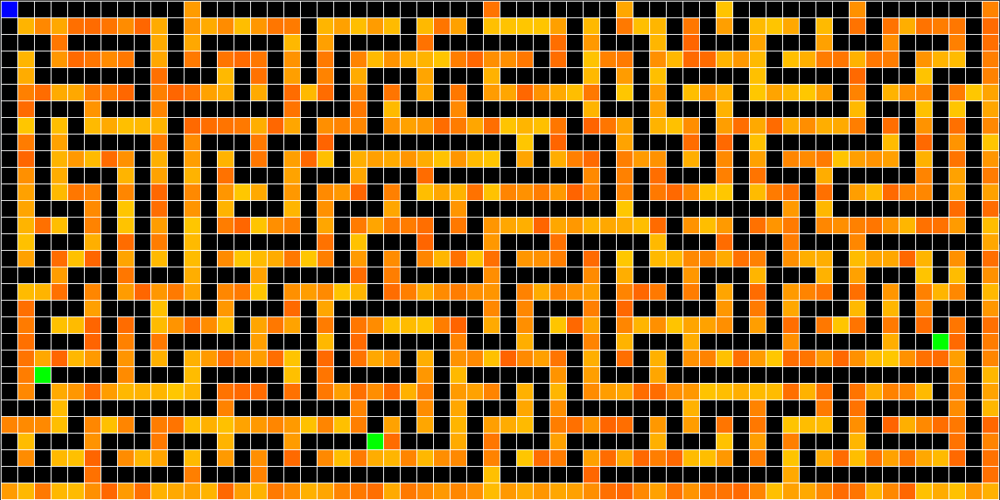

## Player_zombie_game
Game based on maze generation algorithm and AI path finding algorithm.

You control player who is constantly chased by zombies in a maze.

The game has wsad controls.
## Usage
```bash
python3 chaser.py -h
```
```
usage: chaser.py [-h] [-p PLAYER_CORDS [PLAYER_CORDS ...]] [-z ZOMBIE_AMOUNT] window_parameters [window_parameters ...]
```
### positional arguments:
```
  window_parameters     Game parameters: (width_cells_amount, height_cells_amount, cell_width, line_width)

```
### optional arguments:
```
  -h, --help            show this help message and exit
  -p PLAYER_CORDS [PLAYER_CORDS ...], --player_cords PLAYER_CORDS [PLAYER_CORDS ...]
                        Starting player coordinates: (n, m)
  -z ZOMBIE_AMOUNT, --zombie_amount ZOMBIE_AMOUNT
                        Amount of zombies in the game
```
### Example:
```bash
python3  chaser.py 30 60 20 1 -z 3
```

